# Bem vindo ao repositório do projeto Vocabulary Booster

## O que foi desenvolvido

O projeto com o codinome *Vocabulary Booster*, em que vai explorar diversos novos conceitos sobre SQL.

Os desafios deste projeto foram criados com o intuito de providenciar meios para praticar a criação de queries mais elaboradas, utilizando, muitas vezes, diferentes comandos em uma mesma query.

Para te deixar preparado(a) para lidar com qualquer situação, independente da estrutura do banco de dados que esteja utilizando, escolhemos um novo banco para este projeto: o `W3Schools`.

Comece esse novo projeto seguindo as instruções abaixo para restaurar o banco de dados. Bons estudos!

---

## Instruções para restaurar os bancos de dados `W3Schools` e `HR`

Se você já possuir esses bancos em seu MySQL Server e quiser restaurá-los, antes de seguir os passos abaixo será necessário apagá-los, clicando com o botão direito no banco e escolhendo a opção `Drop Schema...`.

1. Faça o download dos arquivos de backup [aqui](w3schools.sql) e [aqui](hr.sql), clicando com botão direito e selecionando "Salvar como" para salvar os arquivos em seu computador.

2. Abra o MySQL Workbench.

3. Vá em `File -> Open SQL Script...` e selecione o arquivo `w3schools.sql`.

4. Selecione todo o código com o atalho `CTRL-A` e clique no ícone de trovão para executar o script.

    

5. Aguarde alguns segundos (espere em torno de 30 segundos antes de tentar fazer algo).

6. Clique no botão apontado na imagem a seguir para atualizar a listagem de banco de dados:

    

7. Verifique se o banco restaurado possui todas as seguintes tabelas:

    

8. Clique com botão direito em cada tabela e selecione "Select Rows". Certifique-se de que todas as tabelas possuem registros. Se alguma estiver vazia ou ausente, faça o passo a seguir. Caso contrário, vá direto para o passo 10.

9. Caso haja tabelas faltando, delete o banco de dados clicando com o botão direito em cima do banco de dados `w3schools` e selecione a opção `Drop Schema...`. Refaça os passos anteriores, desta vez aguardando um tempo maior quando executar o script de restauração.

    

10. O mesmo processo mencionado anteriormente também deve ser feito para restaurar o banco `HR`. Verifique se o banco `HR` restaurado possui todas as tabelas indicadas na imagem abaixo. Se alguma estiver vazia ou ausente, faça o passo a seguir. Caso contrário, vá direto para a próxima seção.

    

11. Caso haja tabelas faltando, delete o banco de dados clicando com o botão direito em cima do banco de dados `hr` e selecione a opção `Drop Schema...`. Refaça o passo anterior, desta vez aguardando um tempo maior quando executar o script de restauração.

---

## Como desenvolver e entregar este projeto

Temos, a seguir, uma série de desafios com diferentes níveis de complexidade. Cada desafio deve ser resolvido em seu próprio arquivo.

1. Leia a pergunta e crie um arquivo chamado `desafioN.sql`, em que N é o número do desafio.

2. O arquivo deve conter apenas o código SQL do desafio resolvido. **Não se esqueça de incluir o ponto e vírgula (";")** no final de suas queries e também de **colocar o nome do banco_de_dados.tabela por completo**, como no exemplo a seguir:

```sql
SELECT * FROM w3schools.customers;
```

3. Faça isso até finalizar todos os desafios e depois siga as instruções de como entregar o projeto em **Instruções para entregar seu projeto**.

---

## Desafios SQL

1. Foi decidido que vamos continuar atendendo apenas à região 1. Sendo assim, usando a tabela `countries` do banco `hr` como referência, precisamos de um relatório em que deve ser exibido o nome do país na coluna `country_name` e uma segunda coluna apelidada de `Status Inclusão`, que exibirá o status do país. Essa segunda coluna deve ser gerada com base no valor da coluna `region_id` e seu valor deve ser "incluído" ou "não incluído". Utilize os comandos condicionais `IF` ou `CASE` para gerar exatamente 25 resultados, como na imagem a seguir:

    

2. Queremos categorizar o nível de cada cargo por salário. Através do uso de condicionais, monte uma query que exiba, utilizando a tabela `jobs` do banco `hr`, primeiramente o `job_title` e, em uma segunda coluna, o nível do salário de acordo com a informação de `max_salary`, apelidando essa coluna de "Nível". Categorize os níveis de remuneração de acordo com a tabela abaixo. Sua query deve produzir 19 resultados, e as colunas devem ser nomeadas assim como na imagem de referência:

    5000 - 10000 - Baixo

    10001 - 20000 - Médio

    20001 - 30000 - Alto

    Acima de 30000 - Altíssimo

    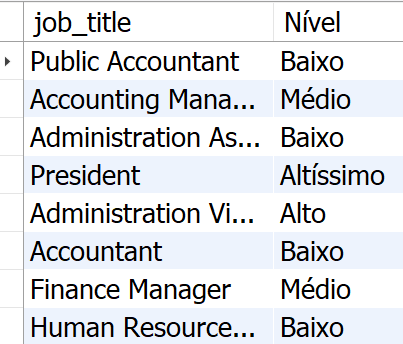

3. Usando o banco `hr`, crie uma query que exiba o `job_title` de todos os cargos registrados na tabela `jobs`. A segunda coluna deve exibir a diferença média entre o salário mínimo e o salário máximo de todos os registros da tabela `jobs` e deve ser apelidada de "Diferença média entre salários mínimos e máximos". Todos os resultados devem estar agrupados por `job_title`. Sua query deve estar ordenada pela média que foi calculada, produzindo exatos 19 resultados.

    

4. Monte uma query usando a tabela `employees` do banco `hr` que exiba três colunas: o `job_id`, com o apelido de "Código do Cargo", a **média salarial** de categoria, com o apelido de "Média" e por fim, a **classificação de cada categoria em nível de senioridade**, com o apelido de "Senioridade", de acordo com a tabela abaixo. Seus resultados devem ser ordenados em ordem crescente usando a média salarial. Considere que os salários mínimo e máximo da tabela `jobs` são salários anuais.

    Média entre 2000 - 5800 -> 'Junior'

    Média entre 5801 - 7500 -> 'Pleno'

    Média entre 7501 - 10500 -> 'Sênior'

    Média acima de 10500 -> 'CEO'

    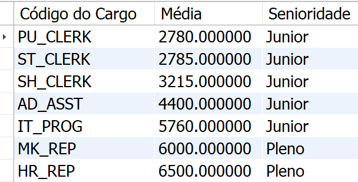

5. Queremos exibir as informações em um formato mais próximo da realidade brasileira, portanto estaremos usando os dados da tabela `jobs` do banco `hr`. Monte uma query utilizando a tabela `jobs` e exiba quatro colunas. A primeira coluna deve exibir o **nome do cargo**, com o apelido "Cargo". A segunda coluna deve exibir a **variação salarial** entre o salário mínimo e o salário máximo daquele cargo, apelidando-a de "Variação Salarial". Na terceira coluna, exiba a média mínima mensal daquele cargo, arredondando o valor com uma precisão de duas casas decimais. A terceira coluna deve ser apelidada de "Média mínima mensal". Exiba na quarta coluna a **média máxima mensal**, arredondada com uma precisão de duas casas decimais e apelide essa coluna de "Média máxima mensal". Seu resultado deve estar ordenado em ordem crescente, usando a coluna "Variação salarial" como base e deve produzir exatamente 19 resultados. Considere que os salários mínimo e máximo da tabela `jobs` são salários anuais.

      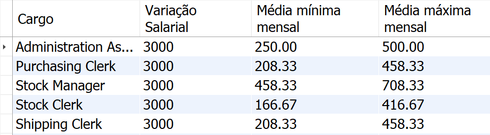

6. Usando as tabelas `employees`, `jobs` e `departments` do banco `hr`, monte uma query que exiba sete colunas, sendo as três primeiras a `start_date`, o `employee_id` e o **nome completo** do funcionário (não se esqueça do espaço entre o nome e o sobrenome) com um apelido de "Nome completo". As próximas duas colunas devem exibir o `job_id` e o **nome do cargo**, com o apelido de "Cargo". Na sequência, as próximas duas colunas devem exibir o **id do departamento** e o **nome do departamento**, com o apelido "Departamento", de todos os funcionários cadastrados na tabela `job_history`. Os resultados devem estar ordenados pelo nome dos funcionários em ordem decrescente. Sua query deve produzir exatos 10 resultados.

    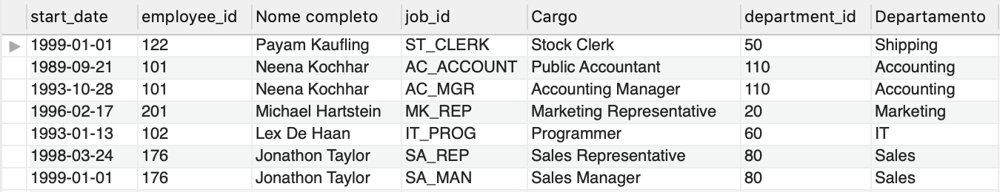

7. Usando as tabelas `job_history` e `employees` do banco `hr`, monte um relatório com as seguintes características: a primeira coluna deve conter o `employee_id` do empregado. A segunda coluna deve conter o **nome completo** desse funcionário em CAIXA ALTA (não se esqueça do espaço entre o nome e o sobrenome). Apelide essa coluna de "Nome completo". A terceira coluna deve mostrar a data de início do empregado naquele cargo (`start_date`). A quarta coluna deve exibir seu salário. Exiba somente os funcionários que iniciaram nos meses 1, 2 ou 3. Ordene seus resultados por nome completo em ordem alfabética. Sua query deve produzir exatamente 6 registros.

    

8. Usando `JOINS` na tabela `orders` e `customers` do banco `w3schools`, exiba as colunas `OrderID`, `CustomerID`, **nome de contato** do cliente e o id da empresa de envio (`ShipperID`). Os resultados devem estar ordenados pelo `CustomerID` em ordem crescente e exibir apenas os resultados em que o `ShipperID` for `1` ou `2`. Sua query deve produzir 128 resultados.

    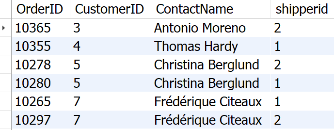

9. Usando a tabela `orders` do banco `w3schools`, exiba duas colunas: a primeira coluna deve ser o `EmployeeId` e a segunda coluna deve exibir o total de pedidos já feitos por aquele funcionário. A segunda coluna deve possuir um apelido de "Total de pedidos". Ordene seus resultados pelo total de pedidos em ordem crescente. Sua query deve retornar apenas 9 resultados.

    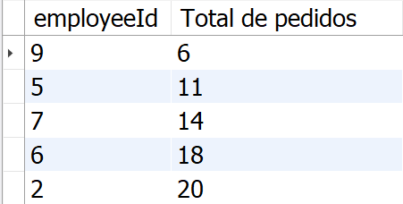

10. Usando a tabela `order_details` do banco `w3schools`, queremos entender como cada produto está se saindo e, para isso, vamos analisar algumas informações sobre os últimos pedidos que foram registrados. Exiba quatro colunas, sendo que a primeira deve ser o `ProductID`. A segunda coluna deve exibir a **quantidade mínima** que já foi pedida deste produto e deve ser apelidada de "Mínimo". A terceira coluna deve exibir a **quantidade máxima** que já foi pedida deste produto e deve ser apelidada de "Máximo". A quarta coluna deve exibir a **média de quantidade nos pedidos** deste produto, arredondada para duas casas decimais e apelidada de "Média". Sua query deve exibir apenas os produtos que possuem uma média de quantidade de pedidos registrados acima de 20.00. Ordene seus resultados em ordem crescente com base na média de quantidade de pedidos. Sua query deve produzir exatamente 48 registros.

    

11. Queremos saber o número de compatriotas de cada cliente presente na tabela `customers` do banco `w3schools`. Crie uma query que exiba o **id do cliente**, seu nome, apelidado de "Nome", o país em que reside, com o apelido "País" e o número de pessoas que moram no mesmo país, com o apelido "Número de Compatriotas". Os resultados devem ser ordenados pelo nome do cliente em ordem alfabética. Sua query deve produzir 88 resultados.

    

12. Usando o `JOIN` apropriado na tabela `employees` do banco `hr`, monte uma query que exiba seis colunas. As três primeiras serão o `first_name`, `salary` e `phone_number` do funcionário. As próximas três serão o `first_name`, `salary` e `phone_number` de todos os funcionários que possuem o mesmo cargo. Seus resultados devem ser ordenados pelo `first_name` da primeira coluna e devem produzir 1839 resultados.

    

13. Exiba o **nome dos produtos** e **preço dos produtos** cadastrados na tabela `products` do banco `w3schools`. Porém, exiba somente produtos que têm uma quantidade de produtos correspondente maior que 80 na tabela `order_details`. Sua query deve produzir exatamente 3 resultados e ser ordenada pelo nome do produto.

    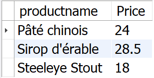

14. O banco `w3schools` possui países cadastrados nas tabelas `customers` e `suppliers`. Queremos saber quais são os cinco primeiros países que estão cadastrados no banco, em ordem alfabética, em qualquer uma das tabelas. Crie uma query que retorne esse resultado.

    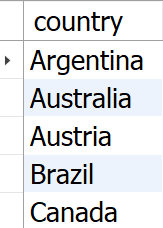

15. Crie uma procedure chamada `BuscarMediaPorCategoriaDeTrabalho` que recebe um parâmetro `VARCHAR` correspondente a um `job_id` da tabela `employees` do banco de dados `hr`. Ao ser executada, sua procedure deverá obter da tabela `employees` a **média salarial arredondada** deste trabalho, arredondada para as duas casas decimais. Dica importante: não esqueça de incluir a linha `USE hr;` antes da declaração de sua procedure. Quando sua procedure for executada com parâmetro 'IT_PROG', deve retornar 5760.00.

    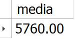

16. Crie uma função chamada `BuscarQuantidadeDeEmpregosPorFuncionario` que, ao receber o **id de um funcionário**, vá até a tabela `job_history`, no banco de dados `hr` e retorne a quantidade de empregos já gravados no sistema relacionados a esse funcionário. Confirme que sua function retorna o valor **2** ao ser chamada passando um funcionário com id **101**.

    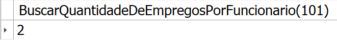

### BÔNUS:

17. Usando a tabela `job_history` do banco `hr`, monte um relatório que exiba o `employee_id`, a sua data de início (`start_date`), no formato brasileiro "dd/mm/aaaa" e com o apelido de "Data Início", a sua data de saída (`end_date`), também no formato brasileiro "dd/mm/aaaa" e com o apelido de "Data Rescisão", e, finalmente, calcule os anos trabalhados (apelidado de "Anos trabalhados") usando como base as datas de saída e entrada, arredondadas para as duas casas decimais. Ordene seus resultados pelo `employee_id`. Sua query deve produzir 11 resultados.

    

18. Crie uma function chamada `ExibirQuantidadePessoasContratadasPorMesEAno` que recebe dois parâmetros: `mes` (sem acento) e `ano`, ambos do tipo `INT`. A function deve ir até a tabela `employees` do banco `hr` e retornar a **quantidade de funcionários** que foram contratados (`hire_date`) dentro do `mes` e `ano` informados. Sua function deverá retornar o resultado **14**, ao ser executada com os parâmetros **mês 6 e ano 1987**.

    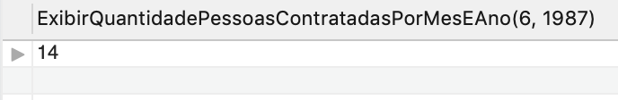

19. Crie uma procedure chamada `ExibirHistoricoCompletoPorFuncionario` que retorna uma informação completa de um funcionário, fazendo uso do banco `hr`. Sua procedure deve receber apenas um parâmetro `employee_id` do tipo `INT` de um funcionário e deve exibir quatro colunas. A coluna primeira será o próprio id que foi passado. A segunda será o nome completo desse funcionário, com o apelido "Nome Completo". A terceira coluna deve conter a descrição do seu cargo, com o apelido "Cargo". A quarta coluna deve exibir o nome do departamento onde este funcionário trabalhou, com o apelido de "Departamento". Quando sua procedure for executada com parâmetro 101, deve retornar a seguinte listagem:

    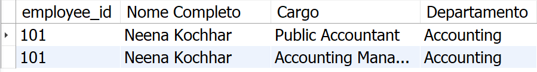

---

## Instruções para entregar seu projeto:

### ANTES DE COMEÇAR A DESENVOLVER:

1. Clone o repositório
  * `git clone https://github.com/tryber/sd-02-block22-mysql-vocabulary-booster.git`.
  * Entre na pasta do repositório que você acabou de clonar:
    * `cd sd-02-block22-mysql-vocabulary-booster`

2. Crie uma branch a partir da branch `master`
  * Verifique que você está na branch `master`
    * Exemplo: `git branch`
  * Se não estiver, mude para a branch `master`
    * Exemplo: `git checkout master`
  * Agora, crie uma branch onde você vai guardar os `commits` do seu projeto
    * Você deve criar uma branch no seguinte formato: `nome-de-usuario-nome-do-projeto`
    * Exemplo: `git checkout -b jhonatan-de-souza-vocabulary-booster`

3. Para cada exercício você deve criar um novo arquivo sql seguindo a seguinte estrutura:
  * desafio1.sql, desafio2.sql, ..., desafioN.sql

4. Adicione as mudanças ao _stage_ do Git e faça um `commit`
  * Verifique que as mudanças ainda não estão no _stage_
    * Exemplo: `git status` (deve aparecer o arquivo que você alterou como desafio1.sql)
  * Adicione o novo arquivo ao _stage_ do Git
      * Exemplo:
        * `git add .` (adicionando solução para desafio 1)
        * `git status` (deve aparecer listado o arquivo _desafio1.sql_ em verde)
  * Faça o `commit` inicial
      * Exemplo:
        * `git commit -m 'iniciando o projeto MySQL Vocabulary Booster'` (fazendo o primeiro commit)
        * `git status` (deve aparecer uma mensagem tipo _nothing to commit_ )

5. Adicione a sua branch com o novo `commit` ao repositório remoto
  * Usando o exemplo anterior: `git push -u origin seunome-mysql-vocabulary-booster`

6. Crie um novo `Pull Request` _(PR)_
  * Vá até a página de _Pull Requests_ do [repositório no GitHub](https://github.com/tryber/sd-02-block22-mysql-vocabulary-booster/pulls)
  * Clique no botão verde _"New pull request"_
  * Clique na caixa de seleção _"Compare"_ e escolha a sua branch **com atenção**
  * Clique no botão verde _"Create pull request"_
  * Adicione uma descrição para o _Pull Request_ e clique no botão verde _"Create pull request"_
  * **Não se preocupe em preencher mais nada por enquanto!**
  * Volte até a [página de _Pull Requests_ do repositório](https://github.com/tryber/sd-02-block22-mysql-vocabulary-booster/pulls) e confira que o seu _Pull Request_ está criado

---

### DURANTE O DESENVOLVIMENTO

* ⚠ **LEMBRE-SE DE CRIAR TODOS OS ARQUIVOS DENTRO DA PASTA COM O SEU NOME** ⚠

* Faça `commits` das alterações que você fizer no código regularmente

* Lembre-se de sempre após um (ou alguns) `commits` atualizar o repositório remoto

* Os comandos que você utilizará com mais frequência são:
  1. `git status` _(para verificar o que está em vermelho - fora do stage - e o que está em verde - no stage)_
  2. `git add` _(para adicionar arquivos ao stage do Git)_
  3. `git commit` _(para criar um commit com os arquivos que estão no stage do Git)_
  4. `git push -u nome-da-branch` _(para enviar o commit para o repositório remoto na primeira vez que fizer o `push` de uma nova branch)_
  5. `git push` _(para enviar o commit para o repositório remoto após o passo anterior)_

---

### DEPOIS DE TERMINAR O DESENVOLVIMENTO

Para **"entregar"** seu projeto, siga os passos a seguir:

* Vá até a página **DO SEU** _Pull Request_, adicione a label de _"code-review"_ e marque seus colegas
  * No menu à direita, clique no _link_ **"Labels"** e escolha a _label_ **code-review**
  * No menu à direita, clique no _link_ **"Assignees"** e escolha **o seu usuário**
  * No menu à direita, clique no _link_ **"Reviewers"** e digite `students`, selecione o time `tryber/students-sd-01`

Se ainda houver alguma dúvida sobre como entregar seu projeto, [aqui tem um video explicativo](https://vimeo.com/362189205).

---

### REVISANDO UM PULL REQUEST

⚠⚠⚠

À medida que você e os outros estudantes forem entregando os projetos, vocês serão alertados **via Slack** para também fazer a revisão dos _Pull Requests_ dos seus colegas. Fiquem atentos às mensagens do _"Pull Reminders"_ no _Slack_!

Use o material que você já viu sobre [Code Review](https://course.betrybe.com/real-life-engineer/code-review/) para te ajudar a revisar os projetos que chegaram para você.
